# Star Tracker Report

**2026-08-17** | Total: **12 stars** | Change: **-13**

> Compared to snapshot from 2026-08-16

## 📈 Star Trend

### By Repository

Individual Repository Charts

#### Adobiz/Pi-Drive-Hub — 6 ★ (-13)

#### Adobiz/VibeKeys — 3 ★ (0)

#### Adobiz/DitingVeritas — 2 ★ (0)

#### Adobiz/LoRA-MT — 1 ★ (0)

#### Adobiz/Adobiz — 0 ★ (0)

#### SugarCubeConference/CiGA2026GGJ — 0 ★ (0)

## Repositories

| Repositories | Stars | Change | Trend |
|:-----------|------:|-------:|:-----:|
| [Adobiz/Pi-Drive-Hub](https://github.com/Adobiz/Pi-Drive-Hub) | 6 | -13 | ⬇️ |
| [Adobiz/VibeKeys](https://github.com/Adobiz/VibeKeys) | 3 | 0 | ➖ |
| [Adobiz/DitingVeritas](https://github.com/Adobiz/DitingVeritas) | 2 | 0 | ➖ |
| [Adobiz/LoRA-MT](https://github.com/Adobiz/LoRA-MT) | 1 | 0 | ➖ |
| [Adobiz/Adobiz](https://github.com/Adobiz/Adobiz) | 0 | 0 | ➖ |
| [SugarCubeConference/CiGA2026GGJ](https://github.com/SugarCubeConference/CiGA2026GGJ) | 0 | 0 | ➖ |

## Summary

- **Stars gained:** 0
- **Stars lost:** 13
- **Net change:** -13

## 🔮 Growth Forecast

**Aggregate Forecast**

| Method | Week 1 | Week 2 | Week 3 | Week 4 |
|:---|---:|---:|---:|---:|
| Linear Regression | 15 | 18 | 20 | 23 |
| Weighted Moving Average | 12 | 12 | 12 | 12 |

### By Repository

Adobiz/Pi-Drive-Hub

**Adobiz/Pi-Drive-Hub**

| Method | Week 1 | Week 2 | Week 3 | Week 4 |
|:---|---:|---:|---:|---:|
| Linear Regression | 9 | 12 | 14 | 17 |
| Weighted Moving Average | 6 | 6 | 6 | 6 |

Adobiz/VibeKeys

**Adobiz/VibeKeys**

| Method | Week 1 | Week 2 | Week 3 | Week 4 |
|:---|---:|---:|---:|---:|
| Linear Regression | 3 | 3 | 3 | 3 |
| Weighted Moving Average | 3 | 3 | 3 | 3 |

Adobiz/DitingVeritas

**Adobiz/DitingVeritas**

| Method | Week 1 | Week 2 | Week 3 | Week 4 |
|:---|---:|---:|---:|---:|
| Linear Regression | 2 | 2 | 2 | 2 |
| Weighted Moving Average | 2 | 2 | 2 | 2 |

Adobiz/LoRA-MT

**Adobiz/LoRA-MT**

| Method | Week 1 | Week 2 | Week 3 | Week 4 |
|:---|---:|---:|---:|---:|
| Linear Regression | 1 | 1 | 1 | 1 |
| Weighted Moving Average | 1 | 1 | 1 | 1 |

Adobiz/Adobiz

**Adobiz/Adobiz**

| Method | Week 1 | Week 2 | Week 3 | Week 4 |
|:---|---:|---:|---:|---:|
| Linear Regression | 0 | 0 | 0 | 0 |
| Weighted Moving Average | 0 | 0 | 0 | 0 |

SugarCubeConference/CiGA2026GGJ

**SugarCubeConference/CiGA2026GGJ**

| Method | Week 1 | Week 2 | Week 3 | Week 4 |
|:---|---:|---:|---:|---:|
| Linear Regression | 0 | 0 | 0 | 0 |
| Weighted Moving Average | 0 | 0 | 0 | 0 |

---
*Generated by [GitHub Star Tracker](https://github.com/fbuireu/github-star-tracker) on 2026-08-17T00:29:19.952Z*

*Made with 🤘 by [Ferran Buireu](https://github.com/fbuireu)*

